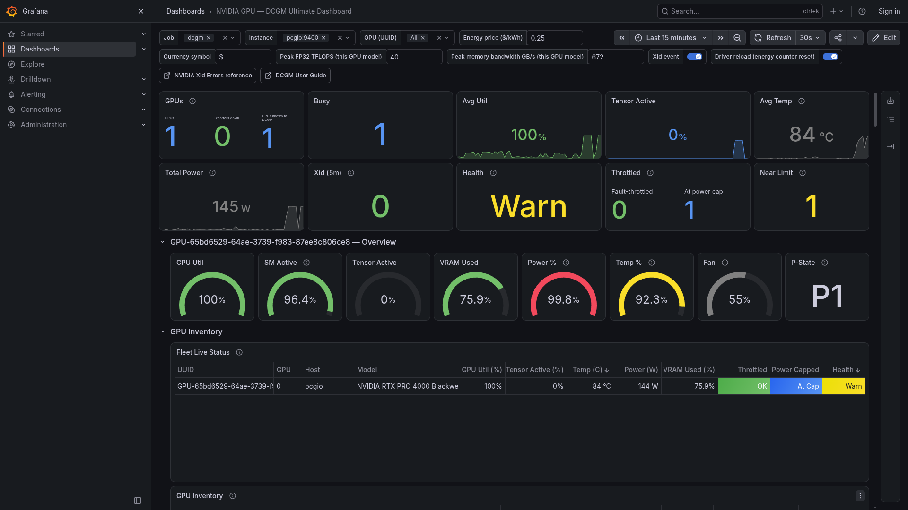

# NVIDIA GPU — DCGM Ultimate Dashboard

[](https://grafana.com/grafana/dashboards/25820/)
[](LICENSE)

Published on Grafana.com: **[NVIDIA GPU — DCGM Ultimate Dashboard — ID 25820](https://grafana.com/grafana/dashboards/25820/)**

A classic Grafana dashboard (schemaVersion 39) for NVIDIA GPUs monitored via **DCGM Exporter**
only — no `nvidia-smi`-based exporter, no Kubernetes dependency. 100 panels across 12 rows, built
from a 168-field custom DCGM counter set: full parity with the popular `nvidia_gpu_exporter`
dashboard (grafana.com **14574**) everywhere DCGM has an equivalent, plus everything DCGM can do
that `nvidia-smi` cannot — real per-unit activity (`DCGM_FI_PROF_*`), energy and cost, true PCIe/
NVLink byte counters, and RAS (ECC / row-remap / XID / recovery).

Built and verified against DCGM 4.7 / go-dcgm v1.4701.1 (dcgm-exporter 4.8.4) on an NVIDIA RTX PRO
4000 Blackwell, Grafana 13.2.2, Prometheus 3.14. Designed to scale from one workstation GPU up to
a multi-host, multi-GPU, NVLink/MIG/vGPU fleet.

## Screenshots



[More screenshots →](screenshots/)

| # | Shows |
|---|---|
| 1 | Top KPI strip, per-GPU overview gauges, Fleet Live Status (worst-first per-GPU table) |
| 2 | Utilization & real activity (profiling): GPU Util vs. SM/Tensor/GR-Engine Active, precision mix, distributions |
| 3 | Clocks & throttling (bitmask decode, fault-violation rates, range-throttled duty cycle, P-State boost time) and power/energy/cost |
| 4 | Thermals/fan (temperature, thermal margin, fan speed) and real PCIe throughput |
| 5 | Reliability: DCGM health check by subsystem (one lane per watch), with the POWER watch going Warn during a load burst and back to Pass |
| 6 | Fleet Live Status and GPU Inventory table showing every label column (UUID, brand, VBIOS, driver, hostname, instance, model, PCI bus ID, FB total, ECC/MIG/virtualization mode) |

Screenshots 1-5 were captured with three short synthetic GPU load bursts (`dcgmproftester13`:
tensor, FP32, PCIe), so the activity graphs, gauges, throttle/power, thermal and PCIe-throughput
panels show real, non-idle data. The same bursts briefly pushed the POWER health watch to Warn
(informational, not a fault — see the gotchas section); the top-strip Health tile in screenshot 1
and the health timeline in screenshot 5 show this, and it clears back to Pass once each burst ends.

## What the dashboard shows, row by row

| Row | Content |
|---|---|
| Top strip (no wrapper) | 10 fleet-at-a-glance tiles: GPUs monitored (+ exporters-down liveness count + GPUs known to DCGM, for spotting a GPU that fell off the bus), GPUs busy, avg util/tensor-active/temp, total power, Xid count (excluding self-healing/informational codes), health, throttled-now (fault-throttled + at-power-cap split), near-limit |
| GPU Overview (repeats per `$gpu`) | Per-GPU gauges: Util, SM Active, Tensor Active, VRAM Used, Power %, Temp %, Fan, P-State |
| GPU Inventory | **Fleet Live Status**: one live row per GPU (Util/Tensor-Active/Temp/Power/VRAM plus color-coded Throttled, Power Capped and Health columns), sorted worst-first — answers "which GPU needs attention now" without scrolling row B. Below it, the static **GPU Inventory** table: one row per GPU with UUID, brand, VBIOS, driver, decoded CUDA driver/compute-capability, FB total, ECC/MIG/virtualization/compute/persistence/CC mode |
| Utilization & Real Activity (Profiling) | `GPU_UTIL` vs. `SM_ACTIVE`/`TENSOR_ACTIVE`/`GR_ENGINE_ACTIVE` (the classic "kernel running but tensor cores idle" view), SM occupancy, DRAM active, FP64/FP32/FP16/INT/tensor precision mix, estimated TFLOPS/bandwidth, utilization distributions, legacy mem/enc/dec util |
| Memory (Framebuffer + BAR1) | VRAM used %, used/free/reserved, total, distribution histogram, BAR1 aperture, an "idle-but-allocated VRAM" zombie-process detector |
| Clocks & Throttling | SM/mem/video clocks vs. max, P-State history, clock-event-reason bitmask decode (all 11 bits), auto-boost, throttle-time-by-reason rate, idle time, fault-violation rate, range-integrated **fraction of range throttled by reason** (bargauge), **time at high performance (P0-P2)** stat |
| Power, Energy & Cost | Power draw vs. the full min/default/current/max/enforced limit stack, 1s-avg vs. instantaneous, power distribution, energy counter vs. measured power, energy this range, estimated cost this range, running cost per hour, idle-power waste |
| Thermals & Fan | GPU temperature vs. slowdown/shutdown/max-op thresholds, memory temperature, thermal margin, temperature distribution, fan speed, fan-vs-temperature overlay |
| PCIe | Real PROF byte-rate throughput, total bytes moved this range, link generation/width vs. max (with a pass/fail flag column), replay and correctable-error rate |
| Video Engines | Encoder/decoder utilization, per-instance NVDEC/NVJPG activity, NVOFA optical-flow activity, host/peer memory cache hit-rate |
| Reliability | ECC mode, volatile vs. aggregate ECC errors, row-remap failure/pending, row-remap events and spare capacity, SRAM-exceeded/memory-unrepairable, retired pages, XID by code and 5-minute count, GPU recovery action, per-subsystem health-check timeline, **health incidents drill-down** (every currently Warn/Fail watch with its DCGM error code and severity — the "why" behind the top-strip Health tile), **exporter scrape status** (per-instance `up` state timeline — the "why" behind the top-strip "Exporters down" count) |
| Datacenter / hardware-specific (collapsed by default) | Fabric Manager/IMEX/C2C table, C2C error counters and throughput, MIG, vGPU license, Blackwell power-profile/smoothing, NVLink aggregate bandwidth and health |

## Why DCGM instead of `nvidia_gpu_exporter` (dashboard 14574)

`nvidia_gpu_exporter` shells out to `nvidia-smi`; DCGM Exporter reads NVML/DCGM directly and adds
fields `nvidia-smi` does not expose at all — most importantly the `PROF_*` family (true per-unit
activity: SM, tensor, DRAM, individual video engines) and true PCIe/NVLink byte counters instead of
a `link_width × link_gen × util%` estimate. The table below maps every 14574 panel family to its
equivalent here.

| 14574 panel/metric family | Equivalent here | Status |
|---|---|---|
| P-State | Per-GPU stat + P-State history timeline | Full parity |
| GPU info table | GPU Inventory table | Full parity, extended (CUDA/compute-capability decode, mode flags) |
| Compute mode | GPU Inventory table | Full parity |
| GPU/memory/power/fan/clock gauges | Per-GPU Overview row, repeated per GPU | Full parity, now repeats automatically per selected GPU |
| Throttle reasons (state timeline) | Clock-event bitmask decode + per-reason NS-counter rates | Full parity, richer (adds cumulative time, not just the instantaneous bit) |
| Memory / temperature / power / fan timeseries | Memory, Thermals, Power rows | Full parity |
| Clock speeds | Clocks & Throttling row | Full parity |
| GPU processes table + per-process memory | Not present | Justified omission — DCGM's only per-process field is a struct dcgm-exporter cannot render as a scalar metric |
| Fabric state | Datacenter row (Fabric Manager/IMEX/C2C table) | Full parity, richer (adds IMEX/C2C) |
| ECC uncorrected (detail) | Reliability row | Full parity, extended with aggregate counts |
| XID errors / last XID / by code | Reliability row (by-code table + 5-minute count) | Full parity, using DCGM's own XID field plus the exporter's dense windowed count instead of a hand-rolled "time since last" formula |
| PCIe throughput | PCIe row | Full parity, using true DCGM byte counters instead of an estimate |
| Energy counter vs. sampled watts | Power, Energy & Cost row | Full parity |
| Energy trailing 24h | Power, Energy & Cost row | Full parity, generalized to the dashboard's own time range |
| MIG memory/SM/tensor panels | Datacenter row (MIG table) | Full parity, gated on MIG mode |
| accounting mode, display mode, driver model, GOM, default application clocks, remapped-row histogram detail, power-smoothing/module-power/EDPP, fabric clique detail | Not present / partial | Justified omission — no DCGM field exists for most of these; GPU recovery action is the one gap DCGM has since closed; power-smoothing is covered at coarse level in the Datacenter row |

Per-link NVLink telemetry (18 links times several field families), NVSwitch-ASIC, ConnectX/
BlueField DPU and Grace CPU-core telemetry are intentionally out of scope for a per-GPU dashboard —
a fleet that needs them should add a supplementary per-link CSV and a repeat-by-link row on top of
this one, rather than shipping ~180 always-empty fields to every single-GPU user.

## Install

### From Grafana.com (recommended)

1. In Grafana: **Dashboards → New → Import**.
2. Enter dashboard ID **`25820`** and click **Load**.
3. At the datasource prompt, pick your Prometheus datasource for `DS_PROMETHEUS`.
4. Import. No further wiring is needed — every panel already targets `${DS_PROMETHEUS}`.

Or import by URL: `https://grafana.com/grafana/dashboards/25820/`

### From this repository

1. In Grafana: **Dashboards → New → Import**.
2. Upload `nvidia-dcgm-dashboard.json` (or paste its contents).
3. At the datasource prompt, pick your Prometheus datasource for `DS_PROMETHEUS`.
4. Import.

Requires Grafana 10.4+ (schemaVersion 39). Confirmed working on Grafana 13.2.2.

## Exporter setup

`custom-counters.csv` (168 fields, in this repo) is a **full replacement** field list for
dcgm-exporter, not an overlay on the stock `default-counters.csv` — it must list everything you
want, including fields the stock CSV already had.

1. Copy it to the host running dcgm-exporter:
   ```
   cp custom-counters.csv /etc/dcgm-exporter/custom-counters.csv
   ```
2. Point `nvidia-dcgm-exporter.service` at it with a systemd override:
   ```
   systemctl edit nvidia-dcgm-exporter.service
   ```
   ```ini
   [Service]
   ExecStart=
   ExecStart=/usr/bin/dcgm-exporter -f /etc/dcgm-exporter/custom-counters.csv -c 5000
   ```
   (`-c` is DCGM's own sample interval in milliseconds; empty `ExecStart=` first clears the unit's
   original command line, which systemd requires before overriding it.)
3. Reload systemd and restart the exporter with the new field list:
   ```
   systemctl daemon-reload && systemctl restart nvidia-dcgm-exporter.service
   ```
4. After that first restart, further edits to the CSV **hot-reload automatically** — dcgm-exporter
   watches the file (fsnotify, ~200 ms debounce) and picks up field additions/removals without a
   restart. Confirmed on dcgm-exporter 4.8.4.

## Prometheus scrape config

```yaml
  - job_name: dcgm
    scrape_interval: 5s
    static_configs:
      - targets: ["<exporter-host>:9400"]
```

Any interval from 5s to 15s works well; set it **greater than or equal to** the exporter's own
`-c`/`--collect-interval` (how often DCGM itself refreshes the watched fields) — scraping faster
just re-reads the same sample, scraping slower loses resolution on instantaneous gauges (rate and
counter fields are unaffected either way).

## Variables

| Variable | Type | Default | Notes |
|---|---|---|---|
| Job | query, multi | all | `label_values(DCGM_FI_DEV_GPU_UTIL, job)` |
| Instance | query, multi | all | Primary node selector — `instance` always exists (Prometheus adds it), unlike the optional `host`/`hostname` label |
| GPU (UUID) | query, multi | all | Chained on UUID, not the raw `gpu` index, which is not stable across hosts |
| Energy price ($/kWh) | textbox | 0.25 | Your electricity price, used by the cost panels |
| Currency symbol | textbox | $ | Applied via each cost panel's `displayName` override — empirically the reliable way to interpolate a template variable into stat-panel text in Grafana 13.2.2; a unit `prefix`/`suffix` interpolation was tried and is a weaker, less consistently supported path |
| Peak FP32 TFLOPS (this GPU model) | textbox | 40 | Matches the RTX PRO 4000 Blackwell used to build this dashboard — **edit per GPU model** to get a meaningful "Achieved TFLOPS" estimate |
| Peak memory bandwidth GB/s (this GPU model) | textbox | 672 | Same GPU's published memory bandwidth — **edit per GPU model** to get a meaningful "Achieved Bandwidth" estimate |

A `peak_tensor_tflops` variable existed in an earlier draft and was removed: NVIDIA does not
publish one dense-precision peak number valid across every GPU/precision combination the way FP32
and memory bandwidth have, so there is no safe non-empty default, and an inert always-empty
textbox is worse than no control at all. Anyone wanting a Tensor-TFLOPS panel can add the variable
back and multiply it by `DCGM_FI_PROF_PIPE_TENSOR_ACTIVE`.

## Annotations

Two dashboard-level annotation queries are built in (toggle each from the variables bar):

| Annotation | Color | Query |
|---|---|---|
| Xid event | Red | `DCGM_FI_DEV_XID_ERRORS{job=~"$job", instance=~"$instance", UUID=~"$gpu"}` — marks the moment a Xid fires (raw per-GPU XID field; the panels elsewhere use the exporter's derived, dense `DCGM_EXP_XID_ERRORS_COUNT`/`_TOTAL` metrics instead) |
| Driver reload (energy counter reset) | Blue | A drop in `DCGM_FI_DEV_TOTAL_ENERGY_CONSUMPTION{...}` — marks when the energy-this-range/cost panels' baseline reset |

Both are live-verified against Prometheus and show up as vertical markers on every timeseries panel.

## Notable DCGM gotchas

- **Series identity / driver upgrades: a GPU can briefly become "two GPUs" to
  Prometheus.** dcgm-exporter attaches `custom-counters.csv`'s "label"-type fields
  (`DCGM_FI_DRIVER_VERSION`, `DCGM_FI_DEV_VBIOS_VERSION`, `DCGM_FI_DEV_BOARD_SERIAL`,
  `DCGM_FI_DEV_GPU_BRAND`, `DCGM_FI_SYSTEM_NVML_VERSION`, `DCGM_FI_IMEX_DOMAIN_STATUS`,
  `DCGM_FI_DEV_FABRIC_CLUSTER_UUID`, `DCGM_FI_CUDA_GPU_VISIBLE_DEVICES`) to *every*
  series it exports. Prometheus identifies a series by its full label set, so the
  moment that field list changes on a live exporter — a driver/VBIOS upgrade, or any
  hot CSV edit — the exact same physical GPU starts a brand-new series; the old one
  goes stale but stays queryable until it ages out. A query whose window spans that
  change sees the same GPU twice, under two label sets, and every timeseries panel
  drew two overlapping lines under one legend (e.g. two "gpu-node-01 GPU0" lines) until the
  old series aged out (confirmed live: a CSV/driver change added `DCGM_FI_DEV_VBIOS_
  VERSION`/`DCGM_FI_DEV_BOARD_SERIAL`/etc. to the label set, and `tools/check_series.py`
  caught 35 duplicated legends across the dashboard for it). Fixed by aggregating
  every per-GPU query through `lib.per_gpu()`, which groups by `lib.GPU_ID_LABELS` —
  the label subset that is stable across this kind of change (job/instance/hostname/
  gpu/UUID/modelName/pci_bus_id/device, plus MIG's GPU_I_ID/GPU_I_PROFILE so a MIG
  instance is never merged with another on the same GPU) — instead of the metric's
  full, CSV-churn-sensitive label set. See `dcgm_dashboard/CONVENTIONS.md`'s
  `lib.per_gpu()` section for which aggregator (`max`/`sum`/`avg`) a given query
  needs, and `tools/check_series.py` for the tool that catches a regression here
  (run it whenever the CSV's field list changes, over a window spanning the
  change). The three tables that display a CSV label-type field as a real column
  (GPU Inventory id 21, Fabric/IMEX/C2C id 87, MIG id 90) are the deliberate
  exception — `lib.per_gpu()` would aggregate away the very field they exist to
  show, so they keep their raw target(s) unaggregated. On stock Prometheus, an
  *instant* query's own staleness markers already stop a raw target from returning
  both the old and new label-set series for one GPU (verified live) — but a backend
  without staleness markers (e.g. VictoriaMetrics, some remote-read setups) can keep
  returning the stale row for up to the lookback (~5 min) after a CSV reload,
  rendering as a duplicate row per GPU. `lib.latest_per_gpu()` is the defensive fix
  applied to every raw target in these three tables: it ANDs the raw query against
  `topk by (job, instance, UUID, GPU_I_ID) (1, timestamp(...))`, keeping only the
  most-recently-sampled series per GPU (MIG instances stay distinct via `GPU_I_ID`)
  with every label — including the CSV field the table displays — left intact.

  | Table | Panel id | Raw target(s) deduped with `latest_per_gpu()` |
  |---|---|---|
  | GPU Inventory | 21 | all 12 (identity anchor + FB/mode/CC/CUDA-version columns) |
  | Fabric Manager / IMEX / C2C | 87 | 1 (Fabric Manager Status, the identity anchor) |
  | MIG | 90 | 1 (`MIG_MODE == 1`, the anchor + gate) |

  `GPU_I_ID` keeping two MIG instances on one GPU distinct only holds at this raw-series
  layer, though — panel 90's table also runs its 5 targets through Grafana's `joinByField`
  transform (`lib.table_join()`), which by default keys on bare `UUID` alone, identical for
  every instance on the same GPU. Panel 90 is the one `table_join()` caller that overrides
  this: every target is wrapped in `label_join(expr, "mig_key", "/", "UUID", "GPU_I_ID")`
  and the join runs with `join_field="mig_key"` instead, so a GPU with 2+ active MIG
  instances still gets one row per instance in the rendered table (the synthetic `mig_key`
  field is dropped from display; the plain `UUID` column still shows the clean physical
  UUID). See `dcgm_dashboard/CONVENTIONS.md` gotcha #4 for the full write-up.
- **Violation counters are nanoseconds, not microseconds.** `DCGM_FI_DEV_POWER_VIOLATION`,
  `THERMAL_VIOLATION`, `SYNC_BOOST_VIOLATION`, `BOARD_LIMIT_VIOLATION`, `LOW_UTIL_VIOLATION`,
  `RELIABILITY_VIOLATION`, and the five `CLOCKS_EVENT_REASON_*_NS` fields are all nanosecond
  counters — `rate(x[$__rate_interval]) / 1e9` gives the fraction of time, not `/ 1e6`.
- **Framebuffer fields are MiB, not MB.** Use Grafana's `mbytes` unit (binary), never `decmbytes`.
- **`TOTAL_ENERGY_CONSUMPTION` is millijoules.** `rate(...) / 1e3` gives watts; converting to kWh
  over a range needs `/ 3.6e9`, not `/ 3.6e6` or `/ 3.6e12`. Verified live: two samples 8 seconds
  apart gave a rate of ~3025 mJ/s, i.e. 3.02 W after `/1e3`, matching the concurrently-read
  `POWER_USAGE` idle draw.
- **Clock-event bit `0x400` (RELIABILITY) and `0x200` (BOARD_LIMIT) are informational clock
  limits, not throttling.** `nvidia-smi -q -d PERFORMANCE` shows `Reliability: Active` while a GPU
  idles in P8. This dashboard colors both bits blue (gray is reserved for the separate benign
  bits: GPU_IDLE, APP_CLOCKS, SYNC_BOOST, DISPLAY_CLOCKS) and excludes them from the "throttled
  now" tile and every fault-violation alarm; the five real throttle bits are `0x4` SW_POWER_CAP,
  `0x8` HW_SLOWDOWN, `0x20` SW_THERMAL, `0x40` HW_THERMAL, `0x80` HW_POWER_BRAKE. Of these,
  SW_POWER_CAP is shown in yellow rather than red in the bitmask timeline, the per-reason rate/
  duty-cycle panels, and the top-strip/fleet-table tiles, since hitting the power cap at full
  load is expected, not a fault — the other 4 bits keep the shared red/alarm treatment.
- **Prometheus has no bitwise-AND operator.** The bitmask is decoded with floor division instead:
  `floor(DCGM_FI_DEV_CLOCKS_EVENT_REASONS{...} / <bit>) % 2` yields exactly 0 or 1 per bit.
- **`DCGM_EXP_GPU_HEALTH_STATUS` is 0/10/20 (Pass/Warn/Fail), not a boolean**, with `health_watch`
  (one row per named subsystem, plus `health_watch="ALL"` — DCGM's own separate GPU-wide watch,
  *not* a rollup/derived value of the other 10, that independently catches devastating faults
  with no single named subsystem, e.g. Xid 79 fallen off bus or Xid 95 uncontained ECC),
  `health_error_code` and `health_error_severity` labels. The top-strip Health tile and the Fleet
  Live Status table both take `max()` over *every* watch, `ALL` included, and map 0/10/20 to
  Pass/green, Warn/yellow, Fail/red — `max()` is idempotent under duplication, so including `ALL`
  alongside the other 10 cannot double-count a failure, it can only surface one the other 10
  would have missed. A MONITOR-severity Warn (e.g. the power cap engaging under sustained load)
  is informational, not a failure, which is exactly why severity is surfaced (not just the watch
  name) in the Health incidents drill-down table. Live-verified under a `dcgmproftester13` burst:
  the POWER watch correctly went Warn and the tile/table/drill-down all agreed, then returned to
  Pass once the burst ended.
- **PCIe link generation legitimately drops at idle.** ASPM / dynamic link-speed power management
  parks an idle link at Gen1 even though the GPU and slot both support a higher max generation —
  this is normal power saving, not a fault. An *instant* "current gen == max gen" check therefore
  false-positives as "Downgraded" on every idle sample. The Gen (not Width) check is instead
  range-gated: `max_over_time(DCGM_FI_DEV_PCIE_LINK_GEN[$__range]) >= bool DCGM_FI_DEV_PCIE_MAX_LINK_GEN`
  — "OK" means the link reached its max generation *at some point in the selected range* (i.e. it
  is capable of it, load just hasn't asked for it right now), "Downgraded" only fires when the max
  was never reached across the whole window. Width is left as an instant check (a real width
  downgrade, e.g. a miswired riser, does not fluctuate with load the way Gen does).
- **Compute capability is packed `major*65536 + minor`, not `major<<32`.** `floor(x/65536)` /
  `x mod 65536`. Verified live: raw `786432` decodes to `12.0`, matching `nvidia-smi` exactly.
- **`DCGM_FI_DEV_CLOCKS_EVENT_REASON_SYNC_BOOST_NS` keeps its pre-rename spelling.** DCGM 4.7's
  headers rename field 1421 to `..._SYNC_BOOST_COUNT_NS`, but dcgm-exporter 4.8.4 bundles an
  older go-dcgm whose name-to-ID map does not recognize that name yet — the `_COUNT_` spelling
  fails to load with "unknown ExporterCounter field", while the spelling used in this CSV loads
  and reports data. Re-test before renaming it on a newer dcgm-exporter release.
- **Some fields are legitimately always blank, and that is the healthy state, not a fault:**
  `DCGM_FI_DEV_MEMORY_TEMP` on GPUs without an on-die memory temperature sensor (most workstation
  SKUs), `DCGM_FI_DEV_XID_ERRORS` on a GPU that has never faulted since driver load (an event
  field with no sample until the first Xid fires), `DCGM_FI_DEV_RETIRED_PAGES_*` on Ampere-or-
  newer GPUs (row-remap replaced page retirement). Panels use `or vector(0)` / a friendly
  `noValue` message for these rather than a red "No data".
- **CSV help text must avoid literal double quotes and unescaped commas.** dcgm-exporter parses
  the CSV with Go's `encoding/csv` in its strict default mode (no `LazyQuotes`), which hard-fails
  on either — use single quotes and semicolons instead.
- **A Grafana `byRegexp` field-override option must be slash-delimited (`/pattern/`), or it silently
  matches nothing.** A bare pattern like `^Free` is not treated as "starts with Free" — Grafana 13.2.2
  compiles it as the literal, fully-anchored expression `^^Free$`, which can never match a real
  series name, so the override becomes a no-op with no error anywhere (found live, browser-only:
  panel 34's "Free" VRAM series stayed Grafana's default yellow instead of the intended fixed blue;
  the same bug had silently defeated 7 other panels' color/dash/hide overrides, including the
  power-limit-series fill-opacity fix on panel 48, since none of this dashboard's
  `lib.override_by_regex()` calls delimited their pattern). Fixed once, centrally, in
  `lib.override_by_regex()` rather than at each call site.
  This class of bug is invisible to `lint_dashboard.py`/`check_queries.py` (the JSON is schema-valid
  and every query still returns data) — only a rendered dashboard shows it, which is why this
  project's Playwright verification pass exists.
- **Every "label"-type CSV field dcgm-exporter attaches to *every other* metric of a GPU also
  attaches to the derived `DCGM_EXP_*` metrics**, not just the `DCGM_FI_*` ones. A table panel built
  from an instant/`format=table` query over a `DCGM_EXP_*` series (health incidents, XID-by-code)
  needs the same 8-field exclude list as the `table_join()`-based inventory/PCIe/fabric tables, or
  those fields leak in as raw, unrenamed columns ahead of the actually useful ones.
- Every field in `custom-counters.csv` is referenced by at least one panel, so
  `lint_dashboard.py` reports 0 unused-field warnings. `DCGM_FI_SYSTEM_GPU_QUANTITY` is
  used by the top-strip "GPUs" tile's "GPUs known to DCGM" value: it is a per-node device
  count (dcgm-exporter attaches the same value to every GPU series on that node), summed
  across the selected fleet after de-duplicating per instance, and compared against the
  count of GPUs actually producing `DCGM_FI_DEV_GPU_UTIL` samples -- a mismatch is a GPU
  DCGM still knows about but that has stopped reporting telemetry, e.g. one that fell off
  the bus (Xid 79). `DCGM_FI_DEV_XID_ERRORS` is referenced directly by the "Xid event"
  annotation query above, even though every XID panel queries the exporter's derived,
  dense `DCGM_EXP_XID_ERRORS_COUNT`/`_TOTAL` metrics instead.

## Bugs found in reference dashboards, fixed here

While researching grafana.com dashboards 22424 ("AI GPU") and 25526 ("NVIDIA GPU for AI
Workloads"), the following correctness bugs were found and are fixed in this dashboard:

| Dashboard | Bug | Fix here |
|---|---|---|
| 25526 | Energy-to-kWh conversion divides millijoules by `3.6e12` (correct only for microjoules) — under-reports energy and cost by exactly 1000x | Divide by `3.6e9` (1 kWh = 3.6x10^9 mJ) |
| 25526 | `DCGM_FI_DEV_PCIE_REPLAY_COUNTER` shown as a raw, ever-increasing counter with a static `red@1` threshold — turns red once and stays red forever | Wrap in `increase(...[$__rate_interval])`: shows whether replays are happening *now*, not merely "ever" |
| 25526 | ~8 panels (VRAM, clocks, PCIe throughput, power/energy histograms) left on Grafana's copy-pasted default `green@0, red@80` threshold, meaningless on those unit scales | Every panel here gets a real, unit-appropriate threshold or an explicit "informational, no threshold" |
| 25526 | Inconsistent color semantics: top-strip Util/Tensor-Active stats use blue-idle/green-busy, but the Engines & Copy timeseries directly below reuses green/red for the same class of metric | One consistent rule dashboard-wide: activity/throughput metrics are always blue (idle) to green (busy); only temperature, power-vs-limit, throttle and error/reliability metrics use green/yellow/red |
| 22424 | `__inputs` declares `DS_PROMETHEUS` but every panel actually queries a separate, disconnected `${idc}` datasource variable — the import-time datasource prompt does nothing | Every panel and every target here uses `${DS_PROMETHEUS}` directly, nothing else |
| 22424 | Fleet "health" table maps the literal value `8` to "healthy" (really just `count()` of GPUs on a node, assuming exactly 8 GPUs per node) | No such magic-number logic anywhere in this dashboard; health comes from `DCGM_EXP_GPU_HEALTH_STATUS`'s real pass/warn/fail codes |
| 22424 | Three timeseries panels match literal GPU model-name strings (`NVIDIA H100 80GB HBM3`, etc.) — permanently empty on any other GPU | No model-name string matching anywhere; every panel filters on `job`/`instance`/`UUID` template variables only |
| 22424 | "Total GPU utilization" divides by a Kubernetes-pod-label count that is always 0 outside Kubernetes, producing a permanent NaN on a bare-metal host | No Kubernetes-label dependency anywhere in this dashboard |

Dashboard 14574 is architecturally different (built on `nvidia-smi` output, not DCGM) rather than
buggy; its main limitations versus this dashboard are inherent to that exporter, not fixable bugs
— no `PROF_*` real-unit activity exists in `nvidia-smi`, and its PCIe throughput is a
`link_width x link_gen x util%` estimate rather than a true byte counter. Both gaps are exactly
what this dashboard's Utilization/Profiling and PCIe rows close.

Two correctness issues were also found and fixed during this dashboard's own build (not in a
reference dashboard): a `GPU_RECOVERY_ACTION` enum mapping whose values 3 and 4 were transposed
against the installed `nvml.h`, with values 5-7 missing entirely, and this dashboard's own earlier
Kelvin-ratio "fix" for the temperature tiles (below), which was itself a bug and has since been
corrected.

**An earlier Kelvin-ratio "fix" for the temperature tiles was itself wrong (since corrected).**
Panels 10 ("Near Limit") and 17 ("Temp %") originally computed a raw Celsius/Celsius ratio
(`GPU_TEMP / SLOWDOWN_TEMP`) and were "fixed" by adding 273.15 to both sides to get a
thermodynamically-correct Kelvin ratio. That Kelvin ratio is defensible in the abstract, but it is
the wrong tool for a threshold gauge: adding a large constant offset compresses the *meaningful*
range of the ratio (idle-to-slowdown) into a narrow band near 1.0, so a perfectly normal 37C idle
GPU with a 91C slowdown threshold read ~85% — already past both panels' 90% trip points — while a
real reference to the *actual* percentage of headroom used never entered the picture. The current
version drops the Kelvin conversion entirely: panel 17 is a plain Celsius ratio
(`GPU_TEMP / SLOWDOWN_TEMP`, thresholds unchanged at 85%/95%, which now read as sensible
percentages of the slowdown temperature — e.g. 77C/86C of a 91C limit), and panel 10 uses a plain
Celsius margin (`SLOWDOWN_TEMP - GPU_TEMP < 10`, i.e. within 10C of the slowdown point) instead of
a ratio at all. Both are portable across GPU models with different slowdown thresholds and need no
unit-conversion caveat in the tooltip.

## Known limitations

- **Scrape/liveness monitoring is now partial, not absent.** The top-strip
  "Exporters down" count (panel 1) and row K's "Exporter scrape status" timeline (panel 100)
  both query Prometheus's own `up{job=~"$job", instance=~"$instance"}` directly, which catches a
  whole host/exporter going unreachable but not a single GPU disappearing from an otherwise-live
  exporter's output. Panel 1's "GPUs known to DCGM" value (from `DCGM_FI_SYSTEM_GPU_QUANTITY`)
  narrows that second case: it reads the per-node device count DCGM itself reports, so it stays
  at the true GPU count even if `DCGM_FI_DEV_GPU_UTIL` (the "GPUs" value) drops for one of them.
  Every *other* fleet tile (GPUs busy, avg util/temp, total power, Health, ...) is still built
  entirely from `DCGM_FI_*`/`DCGM_EXP_*` series that simply stop existing (rather than turning
  red) when a GPU falls off the bus (Xid 79) — those tiles can still only get quieter or emptier
  in that case, never redder, on their own. Cross-check them against panel 1's three values or
  panel 100 if a fleet count looks lower than expected.
- **Row B's `$gpu — Overview` row title shows the raw GPU UUID**, not a friendly hostname/
  index. Grafana's row-title `$variable` interpolation always renders a template variable's
  underlying *value*, and `$gpu` must hold the UUID (it feeds row B's `UUID="$gpu"` equality
  filter) — there is no separate friendly "display text" for a Prometheus-backed variable
  without restructuring how `$gpu` is defined, which risks breaking that filter elsewhere. Use
  the Fleet Live Status / Inventory tables (row C) for a human-readable per-GPU identity
  instead. (The row title itself no longer doubles the literal word "GPU" — DCGM's
  UUID values already start with `GPU-`, so `"$gpu — Overview"` alone reads correctly as
  "GPU-65bd... — Overview".)

## Regenerating the dashboard

The JSON is generated, not hand-edited. Requires only the Python 3 standard library.

```
python3 build_dashboard.py
```

Writes `nvidia-dcgm-dashboard.json` next to the script. Output is deterministic: fixed panel ids,
`sort_keys=True`, `indent=2` — running it twice produces byte-identical files. `--rows a,b,c,...`
builds a subset of rows (row A is the top strip and has no row wrapper) for fast local iteration;
`--out PATH` changes the output path.

```
python3 tools/lint_dashboard.py nvidia-dcgm-dashboard.json    # static checks: ids, gridPos, datasource refs, units, CSV coverage, rate()-on-gauge, byRegexp delimiters, no stray Kelvin math
python3 tools/check_queries.py nvidia-dcgm-dashboard.json     # runs every target (instant) against a live Prometheus, reports OK/EMPTY/ERROR
python3 tools/check_series.py nvidia-dcgm-dashboard.json      # runs every target (range) and checks for the "two series, one legend" bug (see the series-identity gotcha above)
```

There is no local Grafana/Prometheus in this project anymore. `check_queries.py`/
`check_series.py` default to a Prometheus at
`http://localhost:9090` — pass `--prom URL` to point at a different one.
`tools/import_local.py` is unused/stale (it targeted a local test Grafana that no
longer exists) and should not be run.

## Files in this repository

| Path | Purpose |
|---|---|
| `nvidia-dcgm-dashboard.json` | The generated dashboard (import this into Grafana) |
| `custom-counters.csv` | The 168-field dcgm-exporter field list this dashboard is built against |
| `build_dashboard.py` | Entry point that assembles all rows into the dashboard JSON |
| `dcgm_dashboard/lib.py` | Panel-builder helpers, unit/threshold/mapping libraries, layout engine |
| `dcgm_dashboard/rows/row_*.py` | One module per dashboard row (see `dcgm_dashboard/CONVENTIONS.md` for the row-authoring contract) |
| `tools/lint_dashboard.py` | Static validation (panel ids, gridPos, units, unused/undeclared CSV fields) |
| `tools/check_queries.py` | Runs every panel target (instant) against a live Prometheus and reports OK/EMPTY/ERROR |
| `tools/check_series.py` | Runs every panel target (range) and reports ERROR/series-count/DUPLICATE-legend/empty-label — the tool for the series-identity gotcha above |
| `tools/import_local.py` | Stale: targeted a local test Grafana that no longer exists. Do not use. |
| `screenshots/` | The images used above |
| `LICENSE` | Full text of the GNU General Public License v3 |
| `LICENSES/` | License texts in REUSE layout (GPL-3.0-or-later, and Apache-2.0 for third-party material) |
| `THIRD_PARTY_NOTICES.md` | Attribution for third-party material and the reference dashboards |
| `REUSE.toml` | License/copyright metadata for files that cannot carry a header (JSON, images) |

## License

Copyright (C) 2026 Giovanni Manzoni

This program is free software: you can redistribute it and/or modify it under the terms of the
GNU General Public License as published by the Free Software Foundation, either version 3 of the
License, or (at your option) any later version.

This program is distributed in the hope that it will be useful, but WITHOUT ANY WARRANTY; without
even the implied warranty of MERCHANTABILITY or FITNESS FOR A PARTICULAR PURPOSE. See the GNU
General Public License for more details.

You should have received a copy of the GNU General Public License along with this program. If
not, see <https://www.gnu.org/licenses/>.

The SPDX license identifier is `GPL-3.0-or-later`. It covers every file in this repository, including
the generated `nvidia-dcgm-dashboard.json` and `screenshots/` (declared in `REUSE.toml`, since
JSON and images cannot carry a header), with one exception: `custom-counters.csv` is
`GPL-3.0-or-later AND Apache-2.0`, because some of its field descriptions are adapted from
NVIDIA's [dcgm-exporter](https://github.com/NVIDIA/dcgm-exporter) (Copyright (c) 2021 NVIDIA
CORPORATION, Apache License 2.0). See [THIRD_PARTY_NOTICES.md](THIRD_PARTY_NOTICES.md) for the
affected rows and the reference dashboards, and [`LICENSES/`](LICENSES/) for the license texts.
